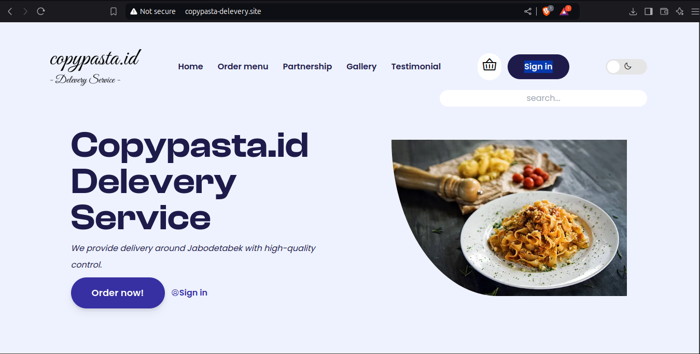

<center><h1>Step by step Deploying website using our own domain.</h1></center>

## Step 1: Prepare Your Website

Make sure your website is ready to go. You should have:

- `index.html`
- Any CSS (`styles.css`) and JavaScript (`app.js`) [If Used]
- Other assets (images, fonts, etc.)

## Step 2: Push Your Website to GitHub (or other Git services)

1. Create a Git repository for your project (e.g., on GitHub).
2. Push your website files to the repository:

   ```bash
   git init
   git remote add origin https://github.com/your-username/your-repo.git
   git add .
   git commit -m "Initial commit"
   git push -u origin main

## Step 3: Connect to Netlify

1. Log in to your <a href="https://app.netlify.com/login">Netlify account.</a> (Register first if you doesn't have account)
2. Click "New Site from Git".<br>
    - After logging in, you will land on the Netlify dashboard. Look for the button labeled "New Site from Git" (usually found on the dashboard or in the top-right section of the screen).
3. Choose your Git provider (GitHub, GitLab, or Bitbucket).
    - You will be prompted to select your Git provider (GitHub, GitLab, or Bitbucket). Click the button for the provider where your project is hosted.

    - For GitHub, you'll see an option like this:
        - GitHub (sign in if necessary, and grant permissions to Netlify)
4. Select your repository and follow the prompts.
    - Once you've connected to your Git provider, Netlify will show you a list of repositories from your Git account. Select the repository that contains your project.
5. Start Deployment
    - Once everything is connected, click Deploy Site. Netlify will automatically start building and deploying your website.


## Step 4: Creating your own domain at niagahoster

1. Log in to your <a href="https://auth.hostinger.com/ng/login">Niagahoster Account.</a> (Register first if you doesn't have account)
2. Check the availability of domain names using Niagahoster Domain Check tool.
3. Choose your suitable Domain packages for your site.
4. Choose Payment method and pay. (I prefer QRIS for this step)
5. Wait till your Domain is successful registered. (It may take time a couple hour)
6. And Ta-Da your Domain is completed register.


## Step 5: Connecting your own Domain to your site at Netlify 

1. Open niagahoster and go to your left bar and find Domains > Domain Portofolio.
2. Click 3 dot button at your domain and choose Edit DNS Zone.
3. Click Change Nameservers.
4. Choose Change nameservers at radiobutton and paste nameserver (Name servers get at step 8)
5. Open back your netlify and click Domains at the left bar.
6. Click your domain.
7. Scroll and find Name Servers side.
8. Copy all your Nameservers and paste it at niagahoster nameservers (Nameservers step 4)


## Step 6: Wait for a while to DNS Connect

<center><h3>And Ta-da now you can access your site with your own domain</h3></center>



If you intrested seeing my own website you can click this link : https://copypasta-delevery.site